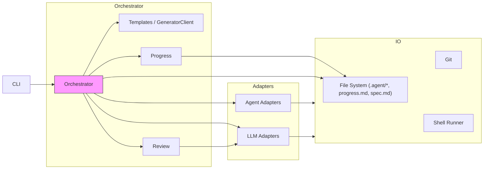
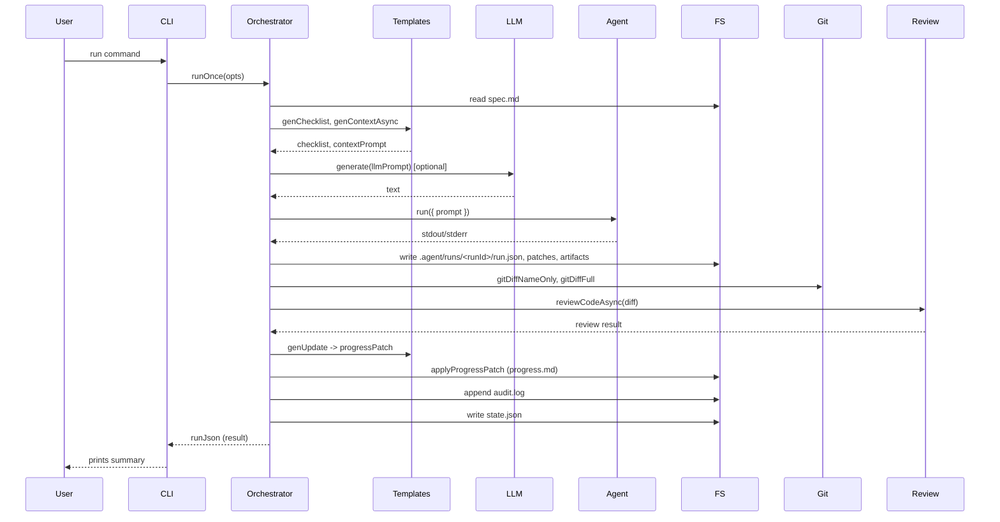

## Overview

This document is an architecture-level summary of the code in this repository (derived only from source files, not .md documents). The project is an "agent orchestrator" that coordinates an LLM, an agent adapter (which may be a CLI wrapper, HTTP agent, or test replay harness), and repository IO to implement spec-driven changes to a codebase.

High-level responsibilities:

- CLI: user-facing commands (run, review, approve, commit, present, clarify, status, init, etc.)
- Orchestrator (`src/core/orchestrator.ts`): the central flow for a single run; composes prompts, calls an LLM adapter, calls an agent adapter, records runs, verifies outcomes, and updates progress/state.
- Generator client (`src/core/generatorClient.ts` and `src/core/templates.ts`): small helpers that call LLMs for context, clarifications, or structured change suggestions. Can fallback to deterministic generators.
- LLM adapters (`src/adapters/llm/*`): provider-specific implementations (Ollama, OpenAI, VLLM, OpenAI-compatible, passthrough) exposing a uniform `generate()` API.
- Agent adapters (`src/adapters/agent/*`): implementations that execute an agent given a prompt and working directory (codex-cli, copilot-cli, http, agent-replay, custom). They return stdout/stderr/exitCode structures.
- IO helpers (`src/io/*`): filesystem, git helpers and command runner that provide safe atomic writes, git diffs, and controlled command execution.
- Progress and review (`src/core/progress.ts`, `src/core/review.ts`): read/write human-oriented `progress.md` sections, compute heuristics for review and review with optional LLM assistance.

This architecture focuses on the orchestration of a single run and the supporting subsystems.

## Component diagram

Notes:

- The CLI is a thin command dispatcher (`src/cli/index.ts`) that invokes `orchestrator.runOnce` or other core commands.
- The Orchestrator is the workflow engine: it builds prompts (via templates), may call an LLM to generate an initial agent prompt, invokes an Agent adapter with that prompt, captures outputs, writes run artifacts to `.agent/runs/<runId>/`, records git diffs, runs verification, produces progress patches, and updates `state.json`.

## Sequence: runOnce (simplified)

Key points:

- The LLM call is optional: the orchestrator can be driven by a provided prompt or generated one.
- Agent adapters encapsulate different ways to run an agent; e.g., `agent-replay` is used by tests to simulate runs by copying fixture runs into `.agent/runs`.
- Execution of shell commands by agents is gated by configuration (`ALLOW_COMMANDS`) and the `runCommand` helper implements dry-run/CI safeguards.

## Data model and storage

- State: `.agent/state.json` (version, currentRunId, status, lastOutcome, nextTask).
- Run artifacts: `.agent/runs/<runId>/run.json` contains inputs, outputs, whatDone, verification, git diffs, and metadata. Optionally `.agent/runs/<runId>/patches.diff` and `applied.marker`.
- Progress: `progress.md` is structured with `##` sections and may contain Checklist, Clarifications, Decisions, Next Task, and Status. `src/core/progress.ts` provides helpers to read and write sections and accept structured ProgressPatch objects.

## LLM adapter contract

- All adapters implement a `generate({ prompt, temperature?, maxTokens?, stop?, system? })` function that returns { text, raw }.
- Adapters included: Ollama (HTTP to Ollama API), OpenAI (official API wrapper), OpenAI-compatible (generic completions endpoint), vLLM (local vLLM endpoint), Passthrough (returns prompt as text for deterministic tests).

## Agent adapter contract

- Agents implement `run({ prompt, cwd, env?, timeoutMs? })` and return an object similar to { stdout, stderr, exitCode } (or more detailed). Adapters:
  - Codex CLI: wraps `codex exec` and writes invocation debug to `.agent/codex-invocation.json`.
  - Copilot CLI: tries known CLI invocations.
  - HTTP agent: POSTs prompt to `AGENT_HTTP_ENDPOINT`.
  - Agent-replay: test harness that selects fixture run data from `tests/e2e/fixtures/replay` and writes it into `.agent/runs/<runId>/run.json`.

## Safety, verification and review

- Verification: `runVerification()` is called in orchestrator after agent output to determine lint/typecheck/test status. If verification fails (lint/typecheck/tests), the run may be marked as `failed` and progress updated accordingly.
- Review heuristics: `reviewCode()` and `reviewCodeAsync()` inspect diffs for file counts, line adds/removals, test touches, and optionally use an LLM (controlled by `USE_LLM_REVIEW`) to make a recommendation. The orchestrator uses this to decide whether human approval is required.
- Applying patches: `src/core/patches.ts` implements robust `git apply` strategies including temp branch transactional application and preserving .rej files when rejects occur.

## Operational notes and edge cases

- Concurrency control: `withLock(cwd, fn)` is used by orchestrator to prevent concurrent runs (locks.ts).
- Human gating: if state is `awaiting_approval`, runs are blocked unless `--force` is passed.
- Command execution safety: `runCommand` only executes real commands when `ALLOW_COMMANDS=1` and not running in CI; otherwise returns DRY-RUN outputs.
- Robustness: many adapters and templates have fallbacks to deterministic behavior when environment or remote services are unavailable (e.g., passthrough LLM, generator fallbacks).
