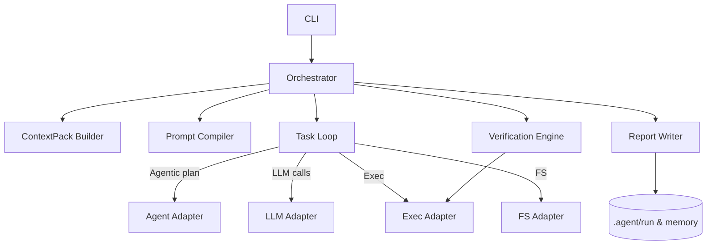

# Phase 3 Implementation Plan — Orchestrator, Prompt Compiler & Context Pack

Status: Draft

## Scope

Phase 3 implements the orchestration layer: assembling context, compiling prompts from templates with schema validation, and wiring the task loop into a policy-driven orchestrator.

This phase builds the ContextPackBuilder, PromptCompiler (template rendering + schema checks), and the Orchestrator that sequences context → prompt → task-loop runs.

## Objectives

- Implement `ContextPackBuilder` to gather spec, repo snippets, last summaries, and progress.json into a prioritized context pack.
- Implement `PromptCompiler` to load templates from `./.agent/templates/*.md`, render them using `<%varName%>` injection, and validate injected inputs against TypeScript/JSON schemas.
- Implement the `Orchestrator` high-level flow: create run id, resolve adapters, build context pack, compile prompts, invoke TaskLoop, and persist artifacts.

## Prompt Templates & Schema Validation

- Templates live in `./.agent/templates/*.md` and use the injection syntax `<%varName%>`.
- Each template must have a corresponding JSON Schema (defined in TypeScript under `src/types/promptSchemas.ts`) describing the expected injected properties.
- The `PromptCompiler` performs runtime validation of template inputs against the schema and fails fast on schema violations.

## Contracts (selected)

- ContextPackBuilder
  - Inputs: spec path, previous summary, repo index
  - Output: { items: ContextItem[], citations, budget }

- PromptCompiler
  - Inputs: context pack, phase, task, checklist, output schema
  - Output: { system, user, schema }

- Orchestrator (top-level)
  - Responsibilities: run lifecycle management, adapter resolution, run folder creation, high-level logging.

## Deliverables (Phase 3)

- `contextPack.ts` implementation + tests extracting prioritized context from repo and spec.
- `promptCompiler.ts` implementation + tests that validate template rendering and schema enforcement.
- `runner.ts` or orchestrator entrypoint wiring the pieces for a programmatic run (CLI wiring postponed to Phase 4).

## Mermaid Diagram

