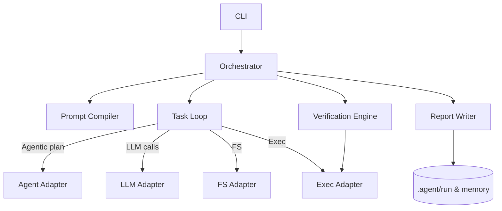

# Phase 3 Implementation Plan — Orchestrator, Prompt Compiler & Context Pack

Status: Draft

## Scope

Phase 3 implements the orchestration layer: assembling context, compiling prompts from templates with schema validation, and wiring the task loop into a policy-driven orchestrator.

This phase builds the PromptCompiler (template rendering + schema checks) and the Orchestrator that sequences context → prompt → task-loop runs. It also introduces run progress tracking so orchestrator components and reviewers can observe and follow a run's state.

## Objectives

- Implement run progress tracking (`progress.json`) writer/reader and minimal schema so runs can persist task state, provenance pointers, and reviewer decisions.
- Implement `PromptCompiler` to load templates from `./.agent/templates/*.md`, render them using `<%varName%>` injection, and validate injected inputs against TypeScript/JSON schemas.
- Implement the `Orchestrator` high-level flow: create run id, resolve adapters, build context pack, compile prompts, invoke TaskLoop, and persist artifacts.

## Prompt Templates & Schema Validation

- Templates live in `./.agent/templates/*.md` and use the injection syntax `<%varName%>`.
- Each template must have a corresponding JSON Schema (defined in TypeScript under `src/types/promptSchemas.ts`) describing the expected injected properties.
- The `PromptCompiler` performs runtime validation of template inputs against the schema and fails fast on schema violations.

## Contracts (selected)

- PromptCompiler
  - Inputs: context pack, phase, task, checklist, output schema
  - Output: { system, user, schema }

- Orchestrator (top-level)
  - Responsibilities: run lifecycle management, adapter resolution, run folder creation, high-level logging.

## Deliverables (Phase 3)

- `progress.json` writer/reader + schema + tests (atomic updates, simple reader API, and audit log writer).
- `promptCompiler.ts` implementation + tests that validate template rendering and schema enforcement.
- `runner.ts` or orchestrator entrypoint wiring the pieces for a programmatic run (CLI wiring postponed to Phase 4).

## Mermaid Diagram



## Progress Tracking — `progress.json`

Purpose: provide a single-source-of-truth for run progress, tasks, and review state that can be read and updated by orchestrator components, reviewers, and verifier agents.

Location: `.agent/run/<id>/progress.json`

Minimal schema (recommended):

```json
{
  "runId": "string",
  "createdAt": "ISO-8601",
  "spec": "path/to/spec.md",
  "phase": "implement|create|new",
  "tasks": [
    {
      "id": "string",
      "title": "short description",
      "type": "diff|exec|llm-call|meta",
      "status": "pending|in-progress|applied|verified|blocked|skipped",
      "appliedAt": "ISO-8601|null",
      "provenancePath": "provenance/<seq>-<adapter>.json",
      "verification": {
        "checks": [{ "name": "lint", "status": "pass|fail|skipped", "outputPath": "..." }],
        "status": "pass|fail|partial"
      },
      "review": {
        "state": "unreviewed|approved|changes_requested|commented",
        "by": "user-id|null",
        "at": "ISO-8601|null",
        "notes": "string|null"
      }
    }
  ],
  "summary": { "success": true, "errors": [] }
}
```
